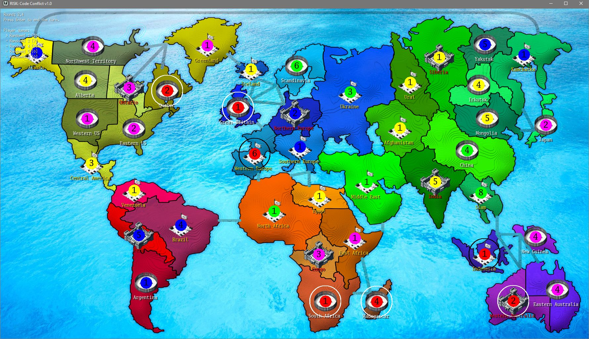

# RISK: Code Conflict

RISK: Code Conflict is a GO implementation of a RISK-like game in the tradition of
[The Gathering's](https://gathering.org) _Hardcore programming competition_.
It is the latest challenge after
[CloudWars](https://github.com/SchnorcherSepp/CloudWars),
[SpaceBumper](https://github.com/SchnorcherSepp/SpaceBumper),
[TankWars](https://github.com/SchnorcherSepp/TankWars) and
[TankWars2](https://github.com/SchnorcherSepp/TankWars2).



## Summary

**RISK: Code Conflict** is a multiplayer strategy game where each player aims to conquer the world by occupying
countries and defeating enemy armies. The game is based on the classic board game Risk and is implemented in the Go
programming language. It features a network architecture that allows players to interact over TCP/IP.

A key objective of this project is for participants to implement their own AI agents and have them compete against each
other.

## Game Rules

- the game is round-based
- players are randomly assigned countries
- a random player starts
- everyone distributes their reinforcements
- then move orders are given to move to neighboring countries
- at the end of each round, all battles are rolled according to the RISK rules

## How to compete

Download the GO source from [Github](https://github.com/SchnorcherSepp/RISKCodeConflict) or the fully compiled binaries
from the [release page](https://github.com/SchnorcherSepp/RISKCodeConflict/releases).
The simulator will act as a TCP/IP game server and simulate and visualize the game according to the formal game rules,
found below.

Each player AI is a separate application written in
the [language of your choice](https://github.com/SchnorcherSepp/RISKCodeConflict/tree/master/examples) that connects to
the simulator via TCP/IP. The clients (player AIs) and server communicate via a simple ASCII protocol over this
connection. This protocol is described in the formal game rules.

The simulator supports several game modes (AI vs AI, AI vs Human). Feel free to try or train your AI against human
players or AI's made by others entering the competition ahead of the compo tournament.

The source code for the simulator is also provided. Feel free to modify it to accommodate any type of testing process
you prefer. You are also free to create your own simulator from scratch, if you wish to do so.

## Protocol

There are only four commands that are sent to the server. This is a string that ends
with a new line. The parameters are separated by a '|' character.

#### AddPlayer

AddPlayer registers or identifies the player with the given name on the server.

    "PLAYER|{name}|{RGB r}|{RGB g}|{RGB b}\n"

Server response

- OK or
- error text

#### Status

Status retrieves the current world status from the server and updates the provided World instance.

    "STATUS\n"

Server response

- World struct as JSON string

#### EndTurn

EndTurn signals the server that the player has finished their turn.

    "END\n"

Server response

- OK or
- error text

#### AttackOrMove

AttackOrMove sends a command to the server to attack or move from one country to another with a specified strength.

    "MOVE|{start country}|{destination country}|{unit number}\n"

Server response

- OK or
- error text

#### Reinforcement

Reinforcement sends a command to reinforce a country with additional strength.

    "MOVE|{target country}|{target country}|{unit number}\n"

Server response

- OK or
- error text

### World

The status of the world is transmitted in a JSON.

```
// World represents the entire game world, containing all continents, countries, and players.
// It acts as the main data structure managing the state of the game.
type World struct {

	// Freeze indicates whether the world state is locked. When set to true,
	// any SET-functions (such as AttackOrMove and EndTurn) have no effect,
	// effectively preventing any changes to the world.
	Freeze bool

	// Round keeps track of the current round number.
	// This value increments by 1 every time all players in the PlayerQueue have completed their turn.
	Round int

	// SubRound keeps track of the current player's turn within a round.
	// It increments after each player's turn and resets to 0 when all players have completed their turns in the round.
	SubRound int

	// Continents is a map of continent names to Continent structs.
	// The key is the name of the continent, and the value is a pointer to the Continent struct.
	// This map allows quick access to information about each continent in the game.
	Continents map[string]*Continent // Key: Continent.Name

	// Countries is a map of country names to Country structs.
	// The key is the name of the country, and the value is a pointer to the Country struct.
	// This map provides easy access to details about each country in the game.
	Countries map[string]*Country // Key: Country.Name

	// PlayerQueue is a slice that maintains the turn order of players during the game.
	// The first player in the queue is the active player. At the end of a turn,
	// the active player is moved to the end of the queue. When new players are added,
	// the queue is shuffled randomly to ensure a fair starting order.
	// The list managing all players participating in the game.
	PlayerQueue []*Player
}
```

In the world there are countries in which armies move.

```
// Country represents a country in the game world. Each country is a distinct region with its own unique name,
// geographical position, neighboring countries, and continent affiliation. It serves as a strategic point of control
// within the game, as each country can be occupied by one player's army and may host battles between opposing armies.
// Countries are connected to their neighbors and continents, influencing both movement and control dynamics.
//
// Additionally, countries can have special statuses, such as being a border region, a fortress region, or a recruiting region,
// which affect gameplay and strategies. Border regions often form strategic choke points, while fortress regions grant
// defensive bonuses, and recruiting regions allow the creation of new units.
type Country struct {

	// Name is the unique identifier for this country within the game world.
	// It is used to refer to the country in various game mechanics, such as when identifying
	// ownership, checking borders, or issuing commands. Examples of country names might include:
	//  - "France"
	//  - "Germany"
	//  - "Brazil"
	Name string

	// Neighbors is a list of names of the countries that share a border with this country.
	// These neighboring countries are directly adjacent to the current country and can be moved to or attacked.
	// The names in this list correspond to the Name values of other Country structs in the game.
	Neighbors []string // value: Country.Name

	// Continent is the name of the continent to which this country belongs.
	// This value corresponds to a Continent.Name value in the game (see World.Continents), linking the country to its continent.
	// Continent affiliation influences game mechanics such as scoring and continent control bonuses.
	// Example values might include:
	//  - "Europe"
	//  - "Africa"
	//  - "South America"
	Continent string // value: Continent.Name

	// BorderRegion indicates whether this country is considered a border region.
	// A border region is a country that shares borders with countries from different continents or holds
	// significant strategic importance due to its location. Controlling border regions often influences
	// the flow of the game, as they serve as gateways between continents or key defensive points.
	BorderRegion bool

	// FortressRegion indicates whether this country is a designated fortress region.
	// Fortresses provide defensive bonuses to the controlling player, making it harder for opposing armies to capture them.
	// A country that is a fortress region may not be a border region, as fortresses are often located away from immediate threats.
	FortressRegion bool

	// RecruitingRegion indicates whether new units can be recruited or raised in this country.
	// Typically, recruiting regions represent strongholds or capitals within the game. A country must be a fortress region
	// to be a recruiting region, while border regions cannot be designated recruiting regions to prevent overpowered troop generation.
	RecruitingRegion bool

	// Occupier is a pointer to the army currently occupying and controlling this country.
	// This value indicates which player owns the country and can defend it against attacks.
	// There must always be an occupier.
	Occupier *Army

	// Invader is a pointer to an attacking army currently attempting to take control of the country.
	// During a battle, the invader will either defeat the occupier and take control, or be destroyed in the attempt.
	// If Invader and Occupier are controlled by the same player, it is only a troop transfer.
	// If Invader is nil, no army is currently attacking this country.
	Invader *Army
}
```

Armies

```
// Army represents a military unit in the game. Each army is associated with a specific player
// and has a certain strength, which determines its combat effectiveness. Armies are stationed
// in a particular country (HomeBase), from where they can launch attacks or defend against enemy forces.
type Army struct {
	world *World

	// Strength indicates the combat power of the army.
	// A higher strength value means the army has more units and is stronger in battle.
	Strength int

	// Player is the name of the player who controls this army.
	// This should correspond to a Player.Name value in the game, identifying the owner of the army (see World.PlayerQueue).
	Player string // value: Player.Name

	// HomeBase is the name of the country where the army is currently stationed.
	// This should match a Country.Name value in the game, indicating the army's current location (see World.Countries).
	HomeBase string // value: Country.Name
}
```

Player

```
// Player represents a player in the game world. Each player has unique attributes, including a name, a color for visual
// representation on the map, and a pool of available reinforcements that they can deploy to strengthen their armies.
// The Player struct is used to track and manage each player's status, territory control, and in-game actions.
type Player struct {

	// Name is the unique identifier for the player within the game (see World.PlayerQueue). The Name value is often
	// used in logs, game commands, and user interfaces to identify which player is performing an action.
	//
	// Example values might include:
	//  - "Player1"
	//  - "AI_Opponent"
	//  - "Strategist_23"
	Name string

	// Color is the visual representation of the player on the game map.
	// Each player is assigned a specific color, which is used to paint their occupied territories,
	// display their units, and differentiate them from other players.
	//
	// The Color value can be set to any valid `color.Color` value. For instance:
	//  - color.RGBA{255, 0, 0, 255} for a red player.
	//  - color.RGBA{0, 0, 255, 255} for a blue player.
	Color color.RGBA // Use concrete type

	// Reinforcement represents the number of reinforcement units currently available to the player.
	// Reinforcements are typically awarded through various in-game mechanics, such as controlling entire continents,
	// capturing enemy territories, or meeting specific game objectives. These units can be deployed by the player
	// to strengthen their armies in occupied countries, giving them a strategic advantage.
	//
	// The Reinforcement value decreases as the player deploys units and increases as they earn new reinforcements
	// at the start of their turn or through special events.
	Reinforcement int
}
```
